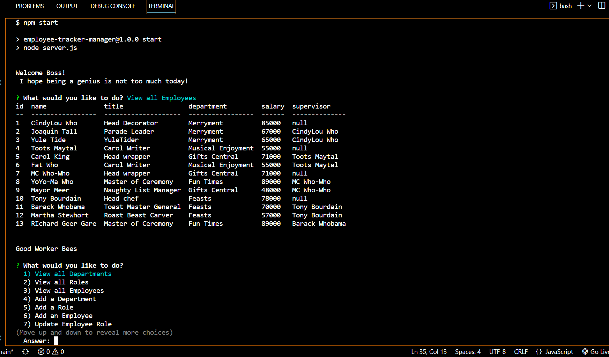

# Employee Tracker Manager
    
  ## Table of Contents
  - [Description](#description)
  - [Installation](#installation)
  - [Usage](#usage)
  - [Image](#image)
  - [Questions](#questions)
    
  ## Description
  This is an actively updated database using MYSQL. Using a fictional company I utilized MYSQL to add and update different tables as needed for a fictional Manager. The base Tables are adapted and Joined to return different fields as needed.
    
  ## Installation
  Run npm start in your terminal to initialize in node.
    
  ## Usage

  This project was created to showcase and practice the different skills I have cultivated using MYSQL.
  
    
  ## Image

  
    
  ## Questions
  If you need any more information on using this application, my email is Simplererstone@gmail.com.
  My GitHub profile can be located here - >  [Simplerer](https://github.com/Simplerer)  < -